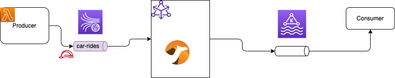
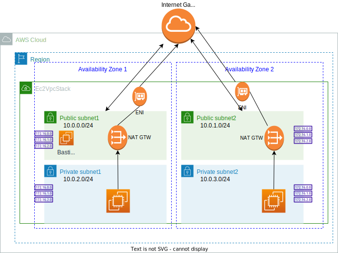
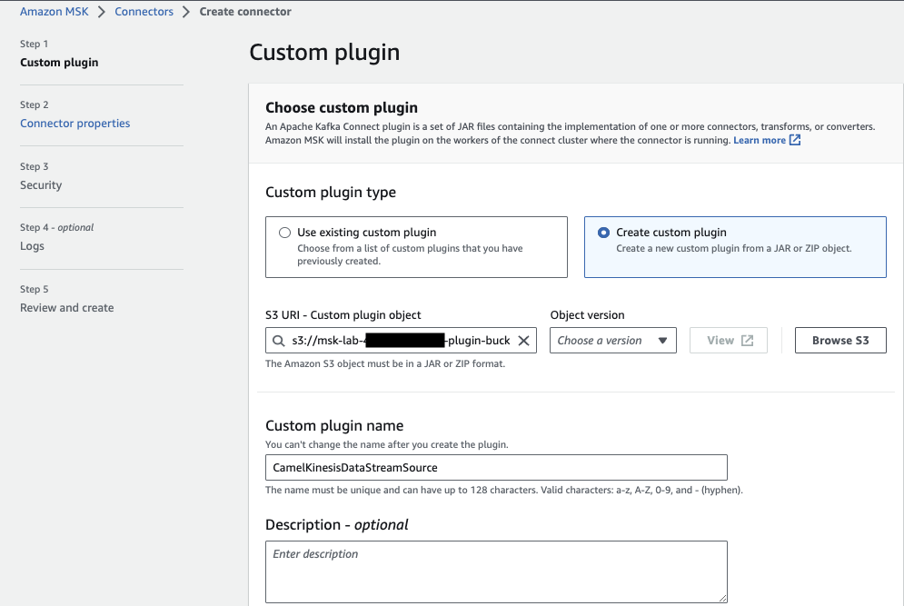

# MSK studies and labs

The goal of this repository is to share some code and practices around MSK.

## Infrastructure

This `infrastucture` folder includes cdk stacks to define the different elements of the labs:

* A Stack for the VPC and a Bastion host to includes Kafka, Java and other important tools.

## Lab 1

The goal of this first proof of technology is to get messages from Amazon Kinesis Data Stream to Amazon Managed Service for Kafka using Kafka Connector Apache Camel source connector.



Part of this solution is defined with Python CDK, and other part with Cloud Formation as MSK CDK is still in Alpha release.

* The VPC to isolate the elements and to define one EC2 Bastion machine, matching the following diagram:



    * One internet gateway
    * Route tables are defined in each private subnet to outbound to NAT gateway
    * ACL to authorize inbound traffic
    * One NAT Gateway per public subnet with one ENI each
    * The bastion host uses a scripts to install Java, maven, docker, kafka, a library to authenticate to MSK, with specific aws Kafka client connection configuration. 
    * The bastion host has a security group to authorize ssh on port 22 from a unique computer (the one running the cdk). It also use an Elastic Network Interface.
    * IAM role is used by the EC2 to access S3, and ECR repository (it may be used to build image and push to ECR)

Jumpstart the infrastructure with cdk on the VPC stack:

```sh
export APP_NAME=acr
cdk deploy acr-vpc
```

* The MSKstack includes a function to define a data streams and a simple Lambda function to post message to the streams.


### Complete the MSK deployment

* Create a cluster configuration from the properties file: `MSKstack/kafka-config.properties` with the following script:

```sh
#In  MSKstack
./addConfiguration.sh
```

* Launch the MSK cluster creation using CDK:

```sh
cdk deploy acr-msk
# it will take some minutes to create
aws kafka list-clusters
```

* The stack creates:

    * Kinesis Data Streams - stream
    * Lambda function to produce to KDS
    * A IAM service role for lambda to create log groups and log streams
    * MSK cluster, with a security group accepting traffic from anywhere (TO REVISIT)
    * Lambda function as MSK consumer 

To do:

* Define one security group to be used by producer, consumer and admin bastion host with port number matching bootstrap. 

### Kinesis Data Streams Producer App

The producer is a simple Lambda python function that is using boto3 Kinesis client to put record in a streams. The streams is defined in the CDK KDSstack, and passes the stream name as environment variable for the Lambda. See Lambda code in [src/kinesis-producer/KinesisProducer.py](https://github.com/jbcodeforce/MSK-labs/blob/main/src/kinesis-producer/KinesisProducer.py) and [CDK KDSstack](https://github.com/jbcodeforce/MSK-labs/blob/main/infrastructure/KDSstack/kds_stack.py).

### MSK and a Lambda topic consumer

A first basic implementation is to use a Lambda consumer and add MSK as an event source. The [CDK MSKstack](https://github.com/jbcodeforce/MSK-labs/blob/main/infrastructure/MSKstack/msk_stack.py) declares MSK cluster, and the lambda function.

We need to declara an IAM role that allows the connector to write to the destination topic. 

For the MSK cluster, the brokers are deployed in private subnet but with security group authorizing access from any hosts.

### Apache Camel Kinesis data streams source connector

The Camel version 3.18.2 includes pre-packaged connector in [this documentation](https://camel.apache.org/camel-kafka-connector/next/reference/index.html) that we can download to a working folder.  Untar and then zip it to upload to S3

```sh
aws s3 cp ~/Code/tmp/camel-aws-kinesis-source-kafka-connector.zip s3://msk-lab-${ACCOUNT_ID}-plugins-bucket/
```

* Ensure MSK cluster is running. Then create a custom MSK Connect configuration using the plugin zip from S3 bucket:



* Add the connector configuration from the [MSKConnect/CamelAwskinesissourceSourceConnector](https://github.com/jbcodeforce/MSK-labs/tree/main/infrastructure/MSKConnect/CamelAwskinesissourceSourceConnector.properties)
* Use auto scaling when we do not know the workload pattern, for demo use provisioned with 1 worker.
* Create a custom IAM role to read from Kinesis Data Streams with trusted entity being KafkaConnect

```json
{
    "Version": "2012-10-17",
    "Statement": [
        {
            "Action": [
                "sts:AssumeRole"
            ],
            "Effect": "Allow",
            "Principal": {
                "Service": [
                    "kafkaconnect.amazonaws.com"
                ]
            }
        }
    ]
}
```

TBC..

MSK [Kafka connect documentation](https://docs.aws.amazon.com/msk/latest/developerguide/msk-connect.html).

## More information

* [AWS MSK workshop - MSK Connect lab](https://catalog.workshops.aws/msk-labs/en-US/mskconnect/overview)
* [Kafka Connect summary note](https://jbcodeforce.github.io/eda-studies/techno/kafka-connect/)
* [Apache Camel 3.18 connector list](https://camel.apache.org/camel-kafka-connector/next/reference/index.html).
* [Debezium Postgres connector](https://repo1.maven.org/maven2/io/debezium/debezium-connector-postgres)