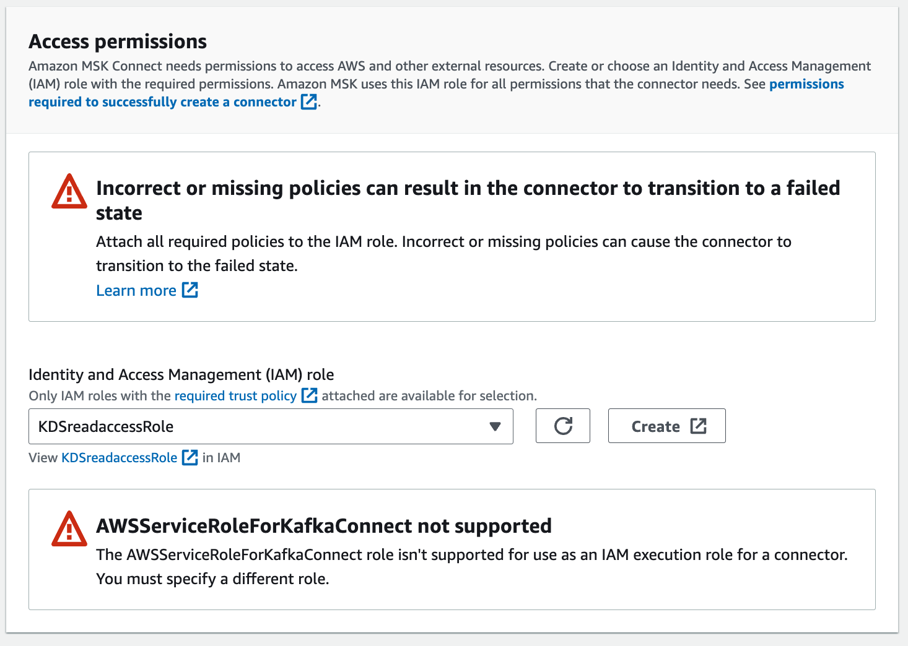

# MSK studies and labs

The goal of this repository is to share some code and practices around MSK.

The goal of this first proof of technology is to get messages from Amazon Kinesis Data Stream to Amazon Managed Service for Kafka using Kafka Connector Apache Camel source connector.


## Infrastructure

Part of this solution is defined with Python CDK, and other part with Cloud Formation as MSK CDK is still in Alpha release and MSK connect is not supported in CDK yet (July 2023).

This `infrastucture` folder includes cdk stack and constructs to define the different elements of the labs:

* A VPC construct to define 2 private and 2 public subnets, with route tables, routes, NAT Gateway and Internet Gateway.
* A contruct for a EC2 Bastion host, with Kafka, Java and other important AWS cli tools
* A construct to define MSK cluster
* A Stack to include the solution components to stitch everything together.

* The VPC matches the following diagram:


    * One internet gateway
    * Route tables are defined in each private subnet to outbound to NAT gateway
    * ACL to authorize inbound traffic
    * One NAT Gateway per public subnet with one ENI each.
    
* The bastion host uses a scripts to install Java, maven, docker, kafka, a library to authenticate to MSK, with specific aws Kafka client connection configuration. 
* The bastion host has a security group to authorize ssh on port 22 from a unique computer (the one running the cdk). It also use an Elastic Network Interface.
* IAM role to be assumed by MSK clients. The policy specifies action on Kafka cluster, topic and groups.
* The SolutionStack includes a function to define a Kinesis data streams and a simple Lambda function to post message to the KDS streams.


### Deployment

1. Create a Kafka cluster configuration from the properties file: `MSKconstruct/kafka-config.properties` with the following script:

```sh
# In  MSKconstruct folder
./addConfiguration.sh
```

1. Use CDK to deploy the solution stack and all needed constructs:

    ```sh
    export APP_NAME=acr
    cdk deploy
    # it will take some minutes to create

    ```

1. Verify cluster state

    ```sh
    aws kafka list-clusters
    ```

1. Ssh to the Bastion host with the key_pair pem. First get the public address of the EC2 instance:

    ```sh
    ssh -i ~/Code/tmp/my-ec2-key-pair.pem ec2-user@PUBLIC_IP_ADDRESS
    ```
1. Get the bootstrap URL for IAM authentication from the MSK console

    

    Or use the cluster arn and the aws cli

    ```sh
    aws kafka describe-cluster --cluster-arn CLUSTER_ARN
    ```

1. Once logged go to the kafka folder and create a topic with the following commands:

    ```sh
    export BS="b-2.......kafka.us-west-2.amazonaws.com:9098,b-1.......kafka.us-west-2.amazonaws.com:9098"
    # in /home/ec2-user/kafka_2.12-3.4.1/bin
    ./kafka-topics.sh --bootstrap-server $BS --command-config client.properties --create --topic carrides --partitions 1  --replication-factor 2
    # Verify topics
    ./kafka-topics.sh --bootstrap-server $BS --command-config client.properties --list
    ```


## Code explanation

### Kinesis Data Streams Producer App

The producer is a simple Lambda python function that is using boto3 Kinesis client to put record in a streams. The streams is defined in the CDK KDSstack, and passes the stream name as environment variable for the Lambda. See Lambda code in [src/kinesis-producer/KinesisProducer.py](https://github.com/jbcodeforce/MSK-labs/blob/main/src/kinesis-producer/KinesisProducer.py) and [CDK Solution stack](https://github.com/jbcodeforce/MSK-labs/blob/main/infrastructure/SolutionStack/main_stack.py).

```python
def defineKDSresources(stack, config):

    stream = kinesis.Stream(stack, 
        config.get("kds_name"),
        stream_name=config.get("kds_stream_name")
    )

    # producer lambda
    kds_producer_lambda = _lambda.Function(stack, config.get("producer_lambda_name"),
                                        runtime=_lambda.Runtime.PYTHON_3_10,
                                        code=_lambda.Code.from_asset("../src/kinesis-producer"),
                                        handler="KinesisProducer.lambda_handler",
                                        environment={
                                            "STREAM_NAME": stream.stream_name
                                        }
                                        )    
    stream.grant_write(kds_producer_lambda)
    return (stream,kds_producer_lambda)
```

### MSK and a Lambda topic consumer

A first basic implementation is to use a Lambda consumer and add MSK as an event source. The [cdk msk-clients](https://github.com/jbcodeforce/MSK-labs/blob/main/infrastructure/MSKstack/msk_stack.py) declares MSK cluster, and the lambda function.

We need to declare an IAM role that allows the connector to write to the destination topic. 

For the MSK cluster, the brokers are deployed in private subnet but with security group authorizing access from any hosts. 

### Apache Camel Kinesis data streams source connector

The full MSK Connect getting started [documentation is here](https://docs.aws.amazon.com/msk/latest/developerguide/mkc-tutorial-setup.html). The following instructions are extracted from the documentation and CloudFormation template.

* From the AWS Console, update the MSK cluster to add a `Unauthenticated` authentication listener and no encryption with plaintext. It may simplify connector connection for demonstration point of view.

    

The Camel version 3.18.2 includes pre-packaged connector in [this documentation](https://camel.apache.org/camel-kafka-connector/next/reference/index.html) that we can download to a working folder.  

* Create a S3 bucket to persist the code of the connector.
* Untar and then zip it, so we can upload to a S3 bucket:

    ```sh
    aws s3 cp ~/Code/tmp/camel-aws-kinesis-source-kafka-connector.zip s3://msk-lab-${ACCOUNT_ID}-plugins-bucket/
    ```

Keep the object arn: s3://msk-lab-.....-plugin-bucket/camel-aws-kinesis-source-kafka-connector.zip

* Create a custom IAM role to read from Kinesis Data Streams with trusted entity being KafkaConnect

    ```json
    {
        "Version": "2012-10-17",
        "Statement": [
            {
                "Action": [
                    "sts:AssumeRole"
                ],
                "Effect": "Allow",
                "Principal": {
                    "Service": [
                        "kafkaconnect.amazonaws.com"
                    ]
                }
            }
        ]
    }
    ```

    Add an inline policy: 

    ```json
    {
	"Version": "2012-10-17",
	"Statement": [
		{
			"Sid": "VisualEditor0",
			"Effect": "Allow",
			"Action": [
				"kafka-cluster:*",
				"kafka:*"
			],
			"Resource": "*"
		}
	]
    }
    ```

* Ensure MSK cluster is running. Then create a custom MSK Connect plugin configuration using the zip from S3 bucket:

    

* Create a connector, and select the cluster with the none authentication mechanism 

    

* Add the connector configuration from the [MSKConnect/CamelAwskinesissourceSourceConnector](https://github.com/jbcodeforce/MSK-labs/tree/main/infrastructure/MSKConnect/CamelAwskinesissourceSourceConnector.properties)

    

* Use auto scaling when we do not know the workload pattern:

    

    and

    

* Select the role created above to access KDS and MSK:

    

* Do not use encryption in transit, as the URL of the MSK will be plaintext.

    

* Get the CloudWatch Log groups ARN to persist logs, and use it in the log configuration of the connector

    


MSK [Kafka connect documentation](https://docs.aws.amazon.com/msk/latest/developerguide/msk-connect.html).

## End to end testing

1. Validate consumer using Kafka tools in the EC2 Bastion host:

    ```sh
    ./kafka-console-consumer.sh --bootstrap-server $BS --consumer.config client.properties --topic carrides --from-beginning
    ```


## More information

* [AWS MSK workshop - MSK Connect lab](https://catalog.workshops.aws/msk-labs/en-US/mskconnect/overview)
* [Kafka Connect summary note](https://jbcodeforce.github.io/eda-studies/techno/kafka-connect/)
* [Apache Camel 3.18 connector list](https://camel.apache.org/camel-kafka-connector/next/reference/index.html).
* [Debezium Postgres connector](https://repo1.maven.org/maven2/io/debezium/debezium-connector-postgres)