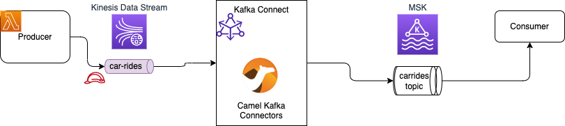

# MSK studies and labs

The goal of this repository is to share some code and practice around MSK.

## Infrastructure

This `infrastucture` folder includes cdk stacks to define the different elements of the labs.

## Lab 1

Get messages from Kinesis Data Stream to MSK using Kafka Connector Apache Camel source connector.



Jumpstart the infrastructure with cdk on the following stacks

```sh
export APP_NAME=acr
cdk deploy acr-vpc
```

### Producer App

